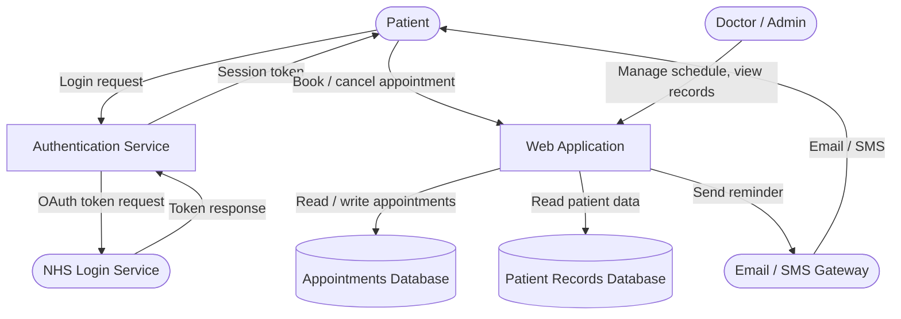

Task B - Threat Model: NHS Patient Appointment Booking System

System Description

This is a web-based appointment booking system for an NHS GP practice. Patients can register, log in, view available slots, and book or cancel appointments. GPs and practice admins can manage their schedules, view patient records, and send appointment reminders. The system holds patient demographic data, NHS numbers, appointment history, and basic medical notes. It integrates with NHS Login for patient authentication, an SMTP email service for appointment reminders, and a third-party SMS gateway for text notifications.

Data Flow Diagram

STRIDE Threat Analysis

1. Spoofing

Threat: An attacker could impersonate a patient by stealing their session token or by brute-forcing weak passwords on accounts that are not protected by NHS Login.
Component affected: Authentication Service
Mitigation: Enforce NHS Login OAuth for all patients. Use short-lived session tokens with secure, HttpOnly, SameSite cookies. Implement account lockout after repeated failed logins.

2. Tampering

Threat: A patient could manipulate HTTP requests to modify another patient's appointment by changing a patient ID in the request body or URL parameter.
Component affected: Web Application, Appointments Database
Mitigation: Enforce server-side authorisation checks on every request. Never trust client-supplied IDs. Verify that the session user owns the resource being modified.

3. Repudiation

Threat: A doctor or admin could deny making changes to patient records or appointment slots if no audit trail exists.
Component affected: Patient Records Database, Appointments Database
Mitigation: Log all create, update, and delete operations with a timestamp and the authenticated user ID. Store logs in an append-only location that application users cannot modify.

4. Information Disclosure

Threat: Patient records or NHS numbers could be exposed if the database is queried without proper access control, or if error messages leak internal details to the browser.
Component affected: PatientDB, Web Application
Mitigation: Apply role-based access control so patients can only see their own records. Suppress detailed error messages in production. Encrypt the database at rest and use TLS for all connections.

5. Denial of Service

Threat: An attacker could flood the booking endpoint with requests, making the system unavailable to real patients trying to book urgent appointments.
Component affected: Web Application
Mitigation: Rate-limit booking and login endpoints by IP. Use a load balancer with request throttling. Set connection timeouts on the database layer.

6. Elevation of Privilege

Threat: A patient account could be manipulated to gain access to doctor or admin functionality, for example by modifying a role field in a cookie or JWT payload.
Component affected: Authentication Service, Web Application
Mitigation: Store roles server-side in the session, never in a client-readable token without a signature. Validate the signature of any JWT on every request. Audit admin endpoints separately.

Trust Boundaries

The main trust boundaries in this system are between the public internet and the web application, between the web application and the internal databases, and between the web application and the external NHS Login and email services. Data crossing these boundaries should be validated and sanitised on the receiving side regardless of where it came from.
